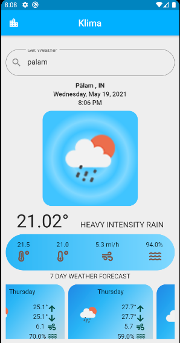

# klima_weather
A Flutter App which tells the weather of the entered city Name. By default it is set to New Delhi. Uses openweatherapi to fetch the weather Data.

# Download
Try the App :- https://drive.google.com/file/d/1p0Pzn5Y-IiAXFhABvlPbJoWahMmm4E2v/view?usp=sharing

# Requirments 
A Android Device with Internet Connections.

# Libraries Used
- intl:- to reterieve date and time
-flutter_spinkit:- for progress indicator
-http for api calling

#Screenshot

#Improvement 
Right now the Forecast for the Next 7 day display wrong weekday.

## Getting Started

This project is a starting point for a Flutter application.

A few resources to get you started if this is your first Flutter project:

- [Lab: Write your first Flutter app](https://flutter.dev/docs/get-started/codelab)
- [Cookbook: Useful Flutter samples](https://flutter.dev/docs/cookbook)

For help getting started with Flutter, view our
[online documentation](https://flutter.dev/docs), which offers tutorials,
samples, guidance on mobile development, and a full API reference.
